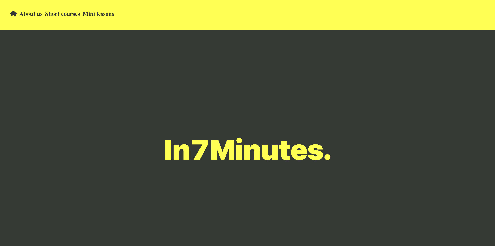
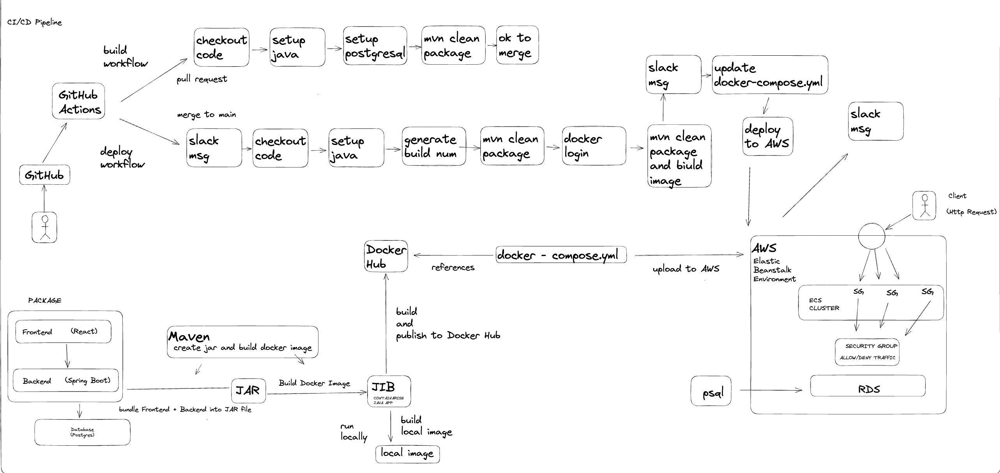

# In7Minutes App
> Live demo [_here_](temporarily unavailable). <!-- If you have the project hosted somewhere, include the link here. -->

## Table of Contents
* [General Info](#general-information)
* [Technologies Used](#technologies-used)
* [Features](#features)
* [Screenshots](#screenshots)
* [Setup](#setup)
* [Usage](#usage)
* [Project Status](#project-status)
* [Contact](#contact)
<!-- * [License](#license) -->

## General Information
-  In7Minutes App is a Learning Management System (LMS) for the administration and delivery of educational courses.

## Technologies Used
- PostgreSQL
- Spring Boot 3
- React 
- Ant Design
- Docker
- GitHub Actions
- Slack
- AWS
- Visual Studio Code
- Intellij IDEA
- macOS - v12.6

## Features
<!-- List the ready features here: -->

- Full CRUD on Courses
- Full CRUD on Lessons

## Screenshots

<!--  -->
<!-- If you have screenshots you'd like to share, include them here. -->

## Setup

<!-- Proceed to describe how to install / get started with the project. -->

## Usage
<!-- How does one go about using it? -->

## Project Status
Project is: _in progress_ 

## Contact
Created by [@GGG](http://3gbg.s3-website.eu-west-2.amazonaws.com/#intro) - feel free to contact me!

